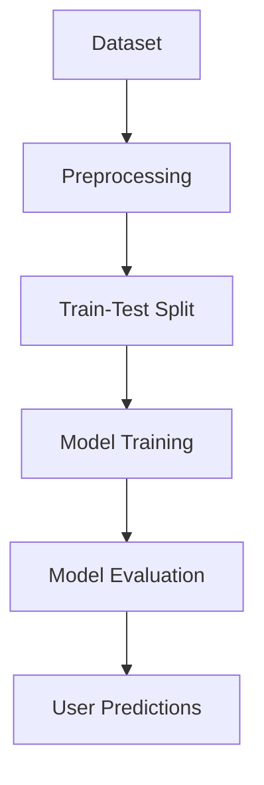

# 1. Prediksi Harga Sepeda Motor Bekas

## Identitas Proyek
**Nama Proyek:** Prediksi Harga Sepeda Motor Bekas  
- **Nama :** Hilmy Syafiq Raihan  
- **NIM :** A11.2022.14317
- **kelompok :** Penambangan Data

**Bahasa Pemrograman:** Python  
**Framework:** Streamlit untuk antarmuka pengguna.


---

# 2. Ringkasan Proyek
**Permasalahan:** Banyak pembeli dan penjual sepeda motor bekas mengalami kesulitan menentukan harga yang sesuai berdasarkan spesifikasi kendaraan. Hal ini sering kali menyebabkan ketidakadilan harga di pasar.  
**Tujuan:** Proyek ini bertujuan untuk membangun model prediksi harga sepeda motor bekas menggunakan algoritma regresi, sehingga dapat memberikan estimasi harga yang akurat berdasarkan spesifikasi kendaraan.  

**Model / Alur Penyelesaian:**
1. **Preprocessing Data:**
   - Mengatasi nilai yang hilang.
   - Mengubah variabel kategorikal menjadi numerik.
2. **Pembagian Dataset:** Memisahkan dataset menjadi data pelatihan dan pengujian.
3. **Pelatihan Model:** Menggunakan algoritma Linear Regression.
4. **Evaluasi Model:** Menilai performa model menggunakan metrik evaluasi seperti MAE dan R-squared.
5. **Prediksi Harga:** Memberikan prediksi harga berdasarkan input spesifikasi dari pengguna.

**Bagan Alur:**


---

# 3. Dataset dan Exploratory Data Analysis (EDA)
**Sumber Dataset:** File `penjualan_sepeda_motor_bekas.csv`.  
**Deskripsi Dataset:** Dataset ini berisi informasi tentang sepeda motor bekas, termasuk:
- **Model:** Tipe atau model sepeda motor.
- **Jenis:** Kategori sepeda motor (misalnya, skuter, sport, bebek).
- **Tahun:** Tahun pembuatan sepeda motor.
- **Pajak:** Biaya pajak tahunan.
- **Konsumsi BBM:** Efisiensi bahan bakar dalam km/liter.
- **Harga:** Harga jual sepeda motor bekas (target prediksi).

**Langkah EDA:**
1. **Pemeriksaan Data:**
   - Identifikasi kolom numerik dan kategorikal.
   - Analisis nilai yang hilang.
2. **Statistik Deskriptif:**
   - Melihat distribusi harga dan fitur numerik lainnya.
3. **Visualisasi Data:**
   - Scatter plot untuk melihat hubungan antara fitur dan target.
   - Box plot untuk mengidentifikasi outlier.

**Proses Features Dataset:**
- **Pengisian Nilai Hilang:** Nilai numerik diisi dengan median untuk menjaga distribusi data.
- **One-Hot Encoding:** Variabel kategorikal seperti model, jenis, dan transmisi diubah menjadi representasi numerik.
- **Pemisahan Fitur dan Target:**
   - Fitur (X): Semua kolom kecuali harga.
   - Target (y): Kolom harga.

---

# 4. Proses Learning / Modeling
**Algoritma yang Digunakan:** Linear Regression  
**Langkah Proses:**
1. **Pembagian Dataset:** Dataset dibagi menjadi 80% data pelatihan dan 20% data pengujian menggunakan fungsi `train_test_split` dari Scikit-learn.
2. **Pelatihan Model:**
   - Model dilatih menggunakan data pelatihan.
   - Optimasi dilakukan untuk meningkatkan akurasi prediksi.
3. **Prediksi dan Evaluasi:**
   - Model diuji menggunakan data pengujian.
   - Hasil prediksi dibandingkan dengan nilai aktual untuk menilai performa model.

---

# 5. Performa Model
**Metode Evaluasi:**
- **Mean Absolute Error (MAE):** Mengukur rata-rata kesalahan absolut prediksi.
- **R-squared Score:** Mengukur proporsi variabilitas data yang dapat dijelaskan oleh model.

**Hasil Evaluasi Model:**
- **Mean Absolute Error (MAE):** [Masukkan Nilai MAE dari model].
- **R-squared Score:** [Masukkan Nilai R2 dari model].

**Catatan:** Performanya cukup baik, tetapi terdapat ruang untuk perbaikan, misalnya dengan menambahkan fitur baru atau menggunakan algoritma machine learning yang lebih kompleks.

---

## Antarmuka Pengguna
Aplikasi ini menggunakan Streamlit untuk antarmuka pengguna:
- **Input Pengguna:**
  - Pilihan model, jenis, dan transmisi sepeda motor.
  - Input spesifikasi lain seperti tahun, pajak, dan konsumsi BBM.
- **Output:**
  - Prediksi harga sepeda motor bekas dalam format mata uang.

Untuk menjalankan aplikasi, jalankan file `App.py` dengan perintah berikut di terminal:
```
streamlit run App.py
```

---

# 6. Diskusi Hasil dan Kesimpulan
**Diskusi Hasil:**
- Model Linear Regression memberikan prediksi yang cukup akurat berdasarkan fitur yang tersedia.
- Faktor eksternal seperti kondisi pasar, lokasi geografis, dan tingkat permintaan tidak tercakup dalam dataset, sehingga dapat memengaruhi hasil prediksi.

**Kesimpulan:**
Proyek ini berhasil membangun model prediksi harga sepeda motor bekas yang dapat membantu pembeli dan penjual dalam menentukan harga secara objektif. Untuk pengembangan lebih lanjut, disarankan untuk:
1. Mengumpulkan data tambahan yang mencakup faktor eksternal.
2. Mengeksplorasi algoritma machine learning yang lebih kompleks seperti Random Forest atau Gradient Boosting.

---

Terima kasih telah menggunakan model ini! Jika ada masukan atau saran, jangan ragu untuk menghubungi pengembang.

